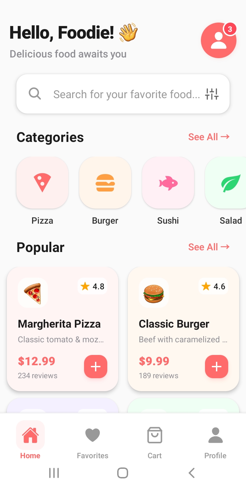

# Food App - React Native Expo

A beautiful, modern food delivery app UI built with React Native and Expo. This is a static UI prototype perfect for learning mobile development.

## Screenshot

## Features

- **Modern UI Design** - Clean, premium food app interface
- **Responsive Layout** - Works on both iOS and Android
- **Static Components** - Perfect for learning React Native styling
- **Icon Integration** - Uses @expo/vector-icons for professional icons
- **Scrollable Content** - Smooth scrolling with proper layout
- **Bottom Navigation** - Sleek navigation bar with active states
- **Food Categories** - Horizontal scrollable categories
- **Popular Foods Grid** - 2-column grid layout with food cards

## Tech Stack

- **React Native** - Mobile app framework
- **Expo** - Development platform
- **@expo/vector-icons** - Icon library
- **JavaScript** - Programming language
- **React Native StyleSheet** - Styling

